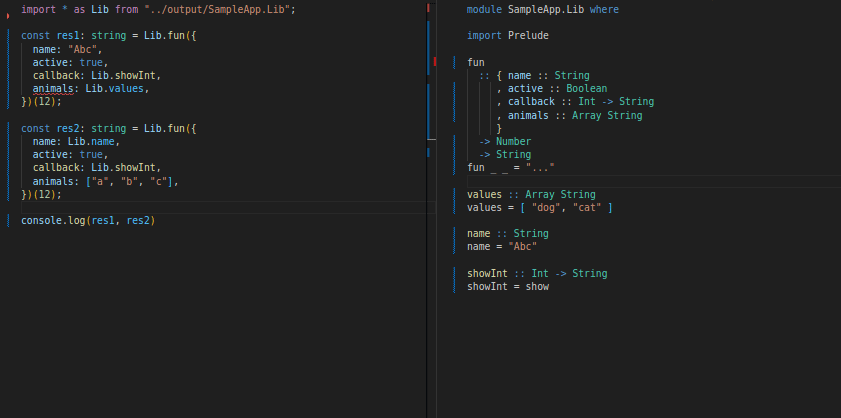

# purescript-ts-bridge

_TypeScript types generated from PureScript_


## Documentation

- [Getting Started Guide](docs/getting-started.md)
- [API Docs on Pursuit](https://pursuit.purescript.org/packages/purescript-ts-bridge)
- [FAQs](docs/faq.md)
- [Type Comparison PureScript vs. TypeScript](docs/type-comparison.md)
- [Demo repo](https://github.com/thought2/purescript-ts-bridge.demo)
- [Blog post: PureScript's foreign Functions less foreign](https://thought2.github.io/blog/purescript-ffi/)
  (explains usage of ts-bridge for FFI)

## Installation

```
spago install ts-bridge
```

## Demo

Some TypeScript - PureScript ping pong ...



## Features

- Fully customizable via a user defined type class pattern
- Many default implementations to pick from (Primitives, Records, Variants, ...)
- Opaque types (implemented as branded types in TypeScript)
- Easily accessible Newtypes
- Module resolution
- Polymorphic types optimized for best type inference in TS
- Tried and tested in production

## How it works

Via type classes a set of types are defined that you'd like to support to export to TypeScript.
The library creates an extra CLI entry point to your app, which generates types for given values of those types. They get written to the file system in the form of TypeScript type declaration (`.d.ts`) files.

## Similar Projects

- [purescript-tsd-gen](https://github.com/minoki/purescript-tsd-gen)
  This project follows a different approach for type generation. It extracts TypeScript types from the PureScript CST. As such the process is more automated but less customizable.

## Support

If you find a bug or have a feature idea feel free to make a PR or file an issue.

<a href='https://ko-fi.com/C0C3HQFRF' target='_blank'></a>
